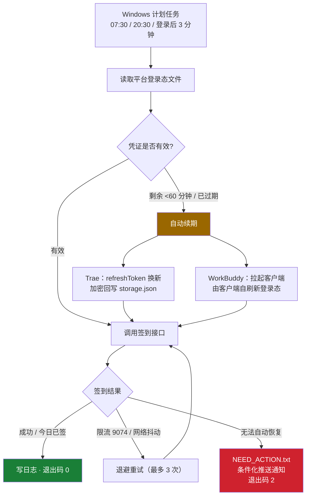

<div align="center">

# workbuddy-trae-auto-checkin

**一个把「装上就不用管」做到位的双平台签到助手**
凭证过期自己续 · 续完自己回写 · 真失败才叫你

*A zero-dependency daily check-in assistant for WorkBuddy & Trae —
auto-renews expired credentials, writes the refreshed session back, and only pings you on a real failure.*

[](#)
[](#)
[](#)
[](#)
[](LICENSE)
[](#贡献指南)

</div>

---

## 目录

- [项目简介](#项目简介)
- [核心优势](#核心优势)
- [功能特性](#功能特性)
- [自愈机制](#自愈机制)
- [输出与交互设计](#输出与交互设计)
- [快速开始](#快速开始)
- [配置](#配置)
- [工作原理](#工作原理)
- [目录结构](#目录结构)
- [使用场景](#使用场景)
- [常见问题](#常见问题)
- [路线图](#路线图)
- [安全说明](#安全说明)
- [贡献指南](#贡献指南)
- [免责声明](#免责声明)
- [许可证](#许可证)

---

## 项目简介

`workbuddy-trae-auto-checkin` 读取你本机 **WorkBuddy** 与 **Trae** 客户端已经保存的登录态，
直接调用官方接口完成每日签到领积分，由 Windows 计划任务定时触发。

它面向的场景很具体：**每天要领的积分总是忘，想起来时已经断签了。**
签到本身只要几秒，但它需要你每天都想起来——这个工具的作用就是把这件事从你的注意力里彻底卸载掉。

同类工具通常只解决一个平台，且遇到凭证过期就报错要求重新登录。
本项目把重点放在**凭证生命周期**上：过期自动续期、续期后回写、真正失败才通知你。

---

## 核心优势

| 痛点 | 常见做法 | 本项目 |
|---|---|---|
| **要管两个平台** | 装两个脚本，配置与日志各一套 | **一个脚本同时管 WorkBuddy 与 Trae**，共用重试 / 通知 / 日志骨架 |
| **凭证过期** | 报错，等你手动重新登录 | **自动用 refreshToken 续期**，用户无感 |
| **续期后客户端掉登录** | 只换不写，工具能签到但 App 要重登 | **加密回写登录态文件**，工具与客户端保持一致 |
| **依赖太多装不上** | 需 `npm install`，依赖链可能出问题 | **零第三方依赖**，只用 Node 内置模块，拷两个文件即可运行 |
| **失败不知道** | 不通知（错过一天），或每天都通知（很快麻木） | **条件化推送**：只有真失败才推微信 |
| **出问题只能猜** | 让你翻源码 | **一条 `--diagnose`** 打印每个候选路径的错误码 |
| **要一直挂着** | 常驻守护进程 / 依赖 AI 自动化触发 | **系统级计划任务**，不常驻、不消耗 AI 额度 |

---

## 功能特性

- **双平台支持** —— WorkBuddy（腾讯 copilot）与 Trae（TRAE SOLO CN / Trae CN 等）
- **零第三方依赖** —— 仅使用 Node 内置模块，无需 `npm install`
- **凭证自动续期** —— accessToken 剩余有效期低于阈值时自动换新
- **加密回写** —— 续期后的新凭证按原算法加密写回，客户端不会掉登录
- **七层自愈** —— 覆盖凭证过期、服务限流、网络抖动、路径变更、瞬时读写抖动
- **幂等运行** —— 一天触发多次只签到一次，重复运行零副作用
- **条件化通知** —— 支持 PushPlus / Server酱 / 企业微信 / 飞书 / Bark 五种通道
- **完整诊断链** —— 离线自检、环境诊断、模拟失败、通知测试
- **语义化退出码** —— `0` 成功 / `1` 可重试 / `2` 需人工，便于接入任何编排
- **凭证零外泄** —— token 不打印、不外传、不落盘；平台登录态文件默认只读

---

## 自愈机制

签到失败的原因很多，本项目把它们整理为**七层递进**的处理策略。绝大多数异常在前五层内自动消化，
你只会感知到「签到了」或「收到一条真失败通知」。

| 层 | 触发条件 | 动作 |
|:--:|---|---|
| **L1** | 凭证有效 | 直接签到 |
| **L2** | 剩余有效期 < 60 分钟 或 已过期 | 用 refreshToken 自动换新 |
| **L3** | 续期成功 | 回写登录态文件，客户端不掉线 |
| **L4** | 网络抖动 / 5xx / 429 | 指数退避重试（3 次） |
| **L5** | Trae `9074` 服务限流 | 温和重试 3 次（15~25 秒随机，避开峰拥） |
| **L6** | 无法自动恢复 | 落 `NEED_ACTION.txt` + 推送通知 + 退出码 `2` |
| **L7** | 登录文件路径变更 | 自动扫描候选目录重新发现 |

> [!NOTE]
> **为什么续期后必须回写？**
> 实测发现 Trae 的 `refreshToken` 会**轮换**——续期后旧值立即失效。
> 如果只把新凭证存在工具内部而不回写平台文件，Trae 客户端下次启动会要求重新登录。
> 本项目用与解密对称的算法重新加密写回，并经往返验证：密文长度 2464 字节，与原值完全一致。

---

## 输出与交互设计

本项目是无 GUI 的命令行工具，**终端输出就是它唯一的界面**，因此输出规范被当作产品设计的一部分来对待。

**状态符号系统**——扫一眼就知道发生了什么：

| 符号 | 含义 | 符号 | 含义 |
|:--:|---|:--:|---|
| `✅` | 签到成功 / 今日已签 | `🔄` | 正在自动续期 |
| `❌` | 失败（需要关注） | `💾` | 新凭证已回写 |
| `↩` | 自动恢复（如重试后读到文件） | `🚀` | 正在拉起客户端刷新登录态 |
| `📣` | 通知已发送 | `⚠` | 警告（不影响主流程） |

**键值对齐**——关键信息成组呈现，便于纵向扫读：

```text
【WorkBuddy】账号：F　　✅ 今天已签到（200 积分已领）
【Trae】　　账号：F.　　设备ID：2486436111858922
　　　　　　✅ 签到成功，本次获得 200 积分
```

**结论优先**——默认只输出结果；调用细节、请求过程收进 `--verbose`。

**永不打印凭证**——任何模式下 token 都不出现在输出或日志中。

---

## 快速开始

### 前置要求

| 项 | 要求 |
|---|---|
| 系统 | Windows 10 / 11 |
| 运行时 | Node.js 18 或更高（**无需 `npm install`**） |
| 账号 | WorkBuddy 与（或）Trae 客户端已在本机登录 |
| 注意 | 脚本以你的身份读取用户目录下的登录态文件，因此**需登录进桌面**才能运行 |

### 步骤 1 · 获取代码

```bash
git clone https://github.com/FaN648512/workbuddy-trae-auto-checkin.git
cd workbuddy-trae-auto-checkin
```

### 步骤 2 · 首次运行（先验证环境）

```bash
# 环境诊断：只读检查，不签到、不发通知
node checkin.js --diagnose
```

期望输出（路径会因机器而异）：

```text
环境变量：LOCALAPPDATA=有  APPDATA=有  USERPROFILE=有
  [ok]     ...\CodeBuddyExtension\...\workbuddy-desktop.info
  [ENOENT] ...\WorkBuddy\...\workbuddy-desktop.info
→ 结论：已找到 ...  凭证：accessToken=有（不显示内容）
→ Trae：已找到 ...\TRAE SOLO CN\User\globalStorage\storage.json
```

### 步骤 3 · 签到

```bash
node checkin.js            # 直接签到
node checkin.js --status   # 只查询余额，不领取
```

看到 `✅ 签到成功` 即表示跑通。

### 步骤 4 · 注册每日计划任务（可选，推荐）

在 **PowerShell** 中执行，注册三个触发器：每天 07:30、每天 20:30、登录后 3 分钟补跑。

```powershell
$name = 'DailyCheckin_WorkBuddy_Trae'
$dir  = (Get-Location).Path
$cmd  = Join-Path $dir 'run_checkin.cmd'

$action    = New-ScheduledTaskAction -Execute $cmd -WorkingDirectory $dir
$settings  = New-ScheduledTaskSettingsSet -StartWhenAvailable -AllowStartIfOnBatteries `
               -DontStopIfGoingOnBatteries -ExecutionTimeLimit (New-TimeSpan -Minutes 30) `
               -MultipleInstances IgnoreNew
$principal = New-ScheduledTaskPrincipal -UserId "$env:COMPUTERNAME\$env:USERNAME" `
               -LogonType Interactive -RunLevel Limited

$today = (Get-Date).ToString('yyyy-MM-dd')
$triggers = @('07:30','20:30') | ForEach-Object {
  New-ScheduledTaskTrigger -Daily -At ($today + 'T' + $_ + ':00')
}
$logon = New-ScheduledTaskTrigger -AtLogOn -User "$env:COMPUTERNAME\$env:USERNAME"
$logon.Delay = 'PT3M'
$triggers += $logon

Register-ScheduledTask -TaskName $name -Action $action -Trigger $triggers `
  -Settings $settings -Principal $principal -Force `
  -Description '每日自动签到：WorkBuddy + Trae'
```

验证任务已注册：

```powershell
Get-ScheduledTaskInfo -TaskName 'DailyCheckin_WorkBuddy_Trae' | Select-Object NextRunTime, LastTaskResult
```

> [!TIP]
> `LastTaskResult = 0` 表示成功。任务注册后**无需任何手动操作**：只要开机、登录进桌面、联网，
> 当天必然签到一次。脚本幂等，多次触发不会重复领取。

---

## 配置

复制模板并按需修改：

```bash
cp config.example.json config.json
```

> [!IMPORTANT]
> `config.json` 内含推送 Token，已被 `.gitignore` 排除，**永远不会进入仓库**。
> 请勿把它分享给任何人。

### 常用配置项

| 配置项 | 默认 | 说明 |
|---|:--:|---|
| `endpoints.*` | 已内置 | 各平台接口地址。**接口变更时改这里即可，无需动代码** |
| `trae.products` | 6 个候选 | Trae 数据目录名候选列表，按你的安装情况增减 |
| `trae.writeBack` | `true` | 续期后是否回写 Trae 登录态文件（关闭可避免任何写入） |
| `trae.refreshAheadMinutes` | `60` | 提前多少分钟触发续期 |
| `workbuddy.launchAppOnExpiry` | `true` | 凭证过期时是否拉起客户端刷新登录态 |
| `workbuddy.appExe` | 空 | WorkBuddy 可执行文件路径（自动拉起时需要） |
| `retry.network` | `3` | 网络层重试次数 |
| `retry.traeBusy` | `3` | Trae 限流（`9074`）重试次数 |
| `notify.type` | `none` | `pushplus` / `serverchan` / `wecom` / `feishu` / `bark` / `none` |
| `notify.token` | 空 | PushPlus、Server酱 只需填 token |
| `notify.url` | 空 | 企业微信、飞书 只需填 webhook url |
| `notify.onFailure` | `true` | 失败时推送 |
| `notify.onSuccess` | `false` | 成功时也推送（默认关闭，避免每天打扰） |

### 通知通道

**默认关闭**——`notify.type` 为 `none` 时完全不推送，不影响签到。

启用微信推送（PushPlus，免费 200 条/天）：
微信扫码登录 [pushplus.plus](https://www.pushplus.plus) → 完成手机号验证 → 复制 Token → 填入 `config.json`。

> [!WARNING]
> PushPlus **不做手机号验证会一直报「用户令牌不正确」**——这不是 Token 拿错了。
> 仓库内 `如何获取PushPlus令牌.html` 提供了带截图的完整步骤说明。

### 命令行参数

| 参数 | 作用 |
|---|---|
| *(无)* | 执行签到 |
| `--status` | 只查询状态与余额，不领取 |
| `--self-test` | 离线自检 10 项，**不发任何网络请求** |
| `--diagnose` | 环境诊断：打印候选路径与错误码，不签到、不通知 |
| `--verbose` | 输出调试细节（仍不打印 token） |
| `--notify-test` | 发送一条测试通知，验证推送通道 |
| `--simulate-failure` | 模拟失败，验证「失败 → 通知」整条链路 |
| `--no-writeback` | 本次不把新凭证回写登录态文件 |

---

## 工作原理



**关于 WorkBuddy 的续期方式**：应用内置的刷新接口（`POST /v2/auth/token/refresh`）
在公网各域名下均返回 `404 Route Not Found`——它运行在专有网关上。
因此本项目改用唯一可靠的手段：凭证快过期时拉起 `WorkBuddy.exe`，由客户端自身完成刷新。
该动作带限频保护（一天最多 2 次、间隔 ≥3 小时），避免反复弹窗。

---

## 目录结构

```text
workbuddy-trae-auto-checkin/
├── checkin.js                    # 主脚本（零依赖单文件，全部逻辑在此）
├── run_checkin.cmd               # Windows 启动器（自动探测 Node 路径）
├── config.example.json           # 配置模板（复制为 config.json 使用）
├── .gitignore                    # 密钥与运行时数据隔离规则
├── LICENSE                       # MIT
├── 项目优化日志.md                # 设计决策与改动记录
├── 如何获取PushPlus令牌.html      # 推送通道申请图文教程
│
│   ── 以下为运行时生成，已被 .gitignore 排除 ──
├── config.json                   # 你的实际配置（含 Token，勿分享）
├── state.json                    # 凭证缓存（含 refreshToken）
├── NEED_ACTION.txt               # 需人工处理的信号文件（正常时不存在）
└── logs/
    └── checkin-YYYY-MM-DD.log    # 按本地日期命名的运行日志
```

---

## 使用场景

- **每天领积分但总忘** —— 设定一次，之后完全不用记得
- **体验版额度不够用** —— 稳定拿满每日签到积分
- **两台机器都要签** —— 各装一份，配置独立，互不影响
- **想接进自己的自动化** —— 通过退出码（`0` / `1` / `2`）与通知通道对接现有编排系统

---

## 常见问题

<details>
<summary><b>计划任务显示「运行中」很久，是卡住了吗？</b></summary>

不一定。脚本自身通常 1~10 秒跑完，但从计划任务被触发到实际启动常有几十秒延迟。
判断是否真卡住请看日志文件的修改时间，而不是任务状态。若持续数分钟无日志增长，再排查。
</details>

<details>
<summary><b>签到失败，收到微信通知了，怎么办？</b></summary>

先看退出码与日志：

- **`1`（可重试失败）** —— 多为网络或接口临时问题，等下一次触发通常会自动成功。
- **`2`（需人工处理）** —— 一般为登录态失效。打开对应的 WorkBuddy 或 Trae 客户端登录一次即可，
  之后 `NEED_ACTION.txt` 会自动清除。

不确定原因时执行 `node checkin.js --diagnose`，它会直接告诉你哪个路径、什么错误码。
</details>

<details>
<summary><b>担心脚本动我的登录态文件？</b></summary>

默认行为：

- **WorkBuddy 登录文件** —— **只读**，从不修改。
- **Trae `storage.json`** —— 仅在自动续期成功后才写入（因为 refreshToken 会轮换，不回写会导致客户端掉登录），
  写入前自动备份为 `storage.json.checkin-bak`。

如果你不接受任何写入，加 `--no-writeback`，或把 `config.json` 的 `trae.writeBack` 设为 `false`。
</details>

<details>
<summary><b>换了电脑还要重新装吗？</b></summary>

需要。脚本与登录态都在本机，配置不跨设备同步——新机器上重新克隆、重新注册计划任务即可。
</details>

<details>
<summary><b>电脑关机的那天会不会漏签？</b></summary>

计划任务启用了「错过则补跑」，开机登录后 3 分钟内会自动补上一次。
唯一的例外是**连续 14 天以上不开机**——此时 Trae 的 refreshToken 会过期，需要手动打开一次客户端重新登录。
</details>

<details>
<summary><b>会被封号吗？</b></summary>

调用频率与手动操作一致（每天一次），且脚本幂等、不会重复请求。
但任何第三方自动化工具都存在潜在风险，是否使用请自行判断。
</details>

<details>
<summary><b>接口变更导致脚本失效怎么办？</b></summary>

所有接口地址都集中在 `config.json` 的 `endpoints` 中，改配置即可修复，无需改动代码。
</details>

---

## 路线图

- [x] 双平台签到（WorkBuddy + Trae）
- [x] Trae 凭证自动续期 + 加密回写
- [x] 七层自愈机制
- [x] 五通道通知 + 条件化推送
- [x] 环境诊断与离线自检
- [ ] 支持 macOS / Linux 计划任务（launchd / systemd）
- [ ] 多账号支持
- [ ] 连续签到天数统计与月度报表
- [ ] 可选 GitHub Actions 云端签到

---

## 安全说明

本项目的安全边界写清楚如下，便于你自行核对：

| 项 | 说明 |
|---|---|
| **凭证来源** | 只读取各平台客户端**已经保存**的登录态文件，不要求输入账号密码或验证码 |
| **凭证去向** | token 仅在内存中使用，**不打印、不外传、不写入任何文件**（工具自身的 `state.json` 仅存续期所需的最小字段） |
| **读取范围** | 只读平台登录态文件；唯一的写入场景是 Trae 续期回写（可关闭，写前自动备份） |
| **网络请求** | 只请求 `config.json` 中列出的平台官方接口与你自己配置的通知地址 |
| **第三方依赖** | 零依赖，不存在依赖链被投毒的可能 |
| **仓库隔离** | `config.json` / `state.json` / `logs/` 已由 `.gitignore` 排除，不会进入公开仓库 |

> [!CAUTION]
> 登录态文件本身就是你的会话凭证。**切勿分享该文件，切勿将 `config.json` 提交到任何仓库。**
> 若你把整个脚本目录打包分享给别人，风险等同于分享登录态。

---

## 贡献指南

欢迎提交 Issue 与 Pull Request。

```bash
# 1. Fork 本仓库

# 2. 创建分支
git checkout -b feature/your-feature

# 3. 提交前自检（不发网络请求）
node checkin.js --self-test

# 4. 提交并推送
git commit -m "feat: 你的改动说明"
git push origin feature/your-feature

# 5. 发起 Pull Request
```

**提交前请确认**：

- 代码保持**零第三方依赖**（仅使用 Node 内置模块）
- 未提交任何含 Token 的文件
- `node --check checkin.js` 语法检查通过
- 新增平台支持时，同步更新 `config.example.json` 与本文档

**报告问题**时，请附上 `node checkin.js --diagnose` 的输出（它不包含任何凭证）。

---

## 免责声明

1. **接口归属**：本项目调用的接口分别位于 `copilot.tencent.com`（WorkBuddy）与
   `api.trae.cn` / `api.trae.com.cn`（Trae）域名下，接口及其返回的数据、权益均归相应权利方所有。
   本项目与腾讯公司、字节跳动公司**无任何隶属、授权或合作关系**，不代表其立场或背书。
2. **商标声明**：WorkBuddy、Trae 等名称与标识均为其各自权利人的商标或服务标识，
   仅在本项目中用于描述兼容对象；本项目为独立第三方工具，未经权利人审核或认可。
3. **使用边界**：仅供**个人自动化学习与技术研究**，禁止商用，
   禁止用于任何违反服务条款、法律法规或所在组织合规要求的行为。
4. **接口稳定性**：接口由平台方独立控制，可能随时变更、调整或下线，
   本项目不保证持续可用，亦不承诺脚本永续有效。
5. **责任承担**：使用者应自行评估使用风险（含账号安全、数据安全与合规风险），
   因使用本项目产生的任何直接或间接后果，由使用者自行承担。
6. **无担保**：本项目按「现状」（AS-IS）提供，不提供任何明示或默示的担保。
7. **配合下架**：如相关权利方认为本项目存在合规问题，作者将积极配合处理。

---

## 许可证

[MIT](LICENSE) © 2026 FaN648512

---

<div align="center">

**如果这个项目帮你省下了每天那几分钟，欢迎点个 ⭐**

[报告问题](https://github.com/FaN648512/workbuddy-trae-auto-checkin/issues) · [提交建议](https://github.com/FaN648512/workbuddy-trae-auto-checkin/issues) · [查看优化日志](项目优化日志.md)

</div>
