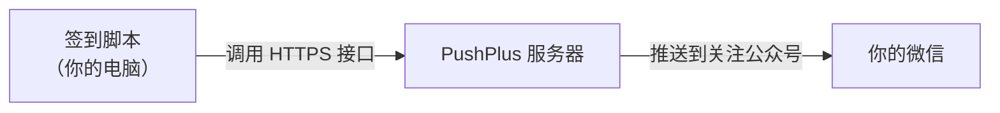
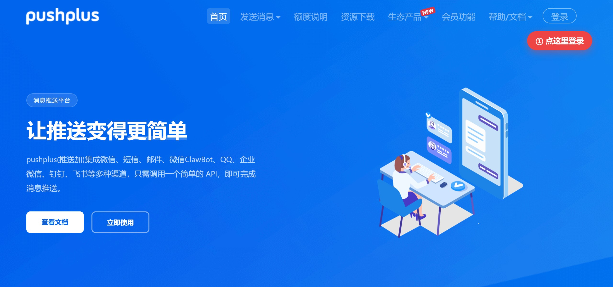
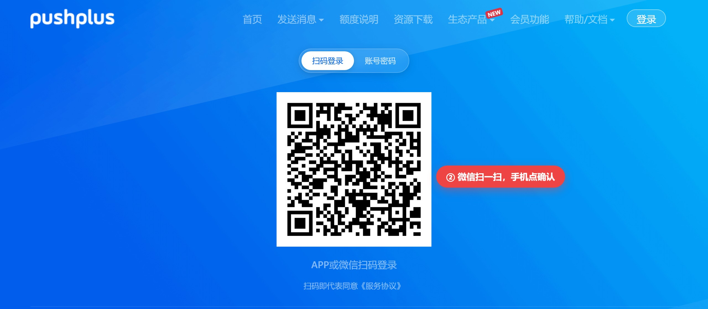
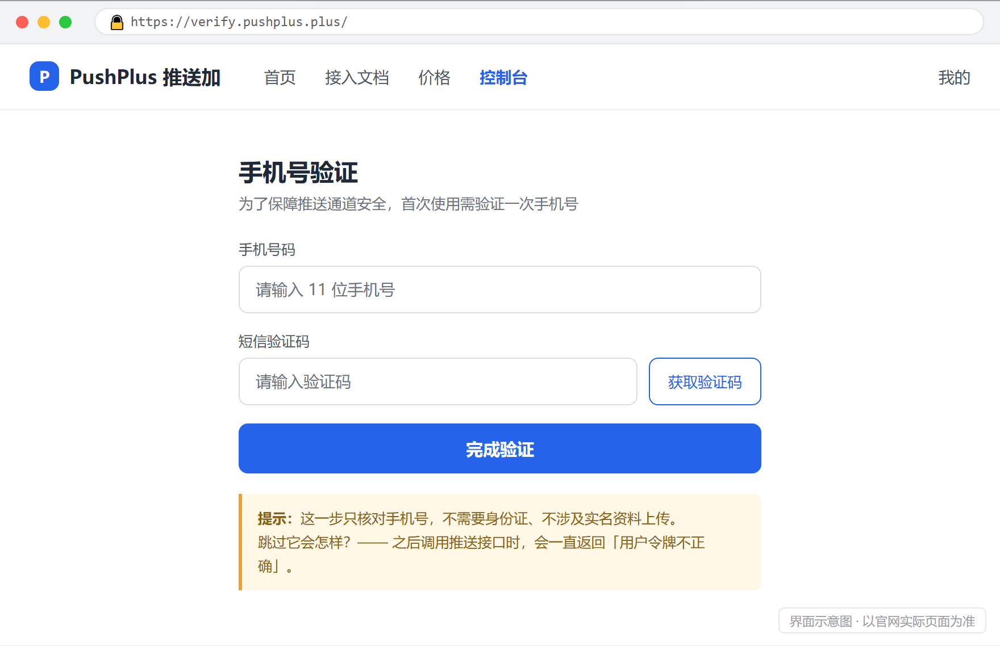
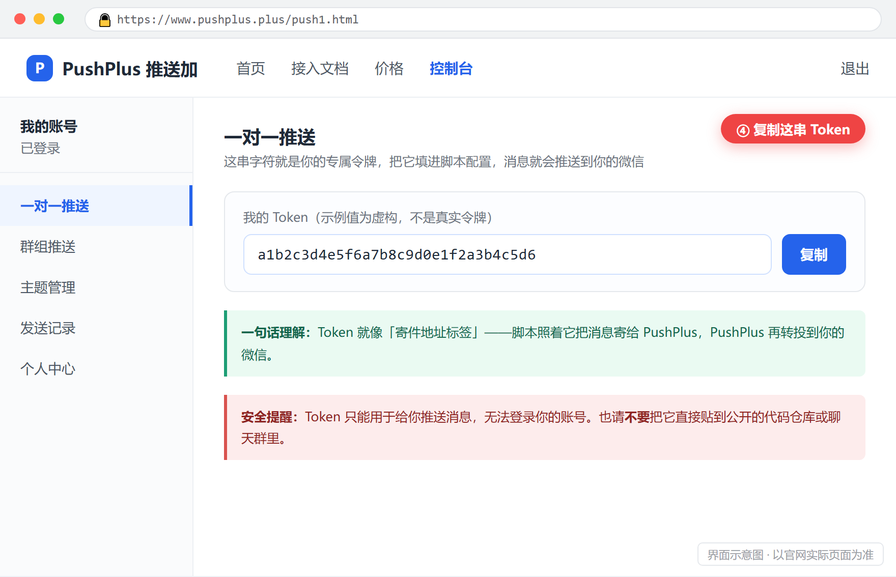
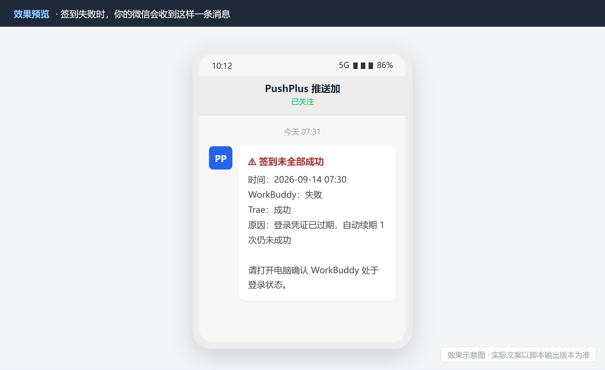

# 如何获取 PushPlus 令牌（Token）

> 用于接收「签到失败」的微信通知 · 全程约 3 分钟 · 完全免费

**一句话总览**：到 PushPlus 官网用微信扫码登录 → 验证一次手机号 → 复制页面上那串 Token → 填进 `config.json`。
有了它，只要签到失败、且你的电脑开着（WorkBuddy 处于登录状态），微信就会立刻收到一条提醒。

---

## 目录

1. [这一步是在做什么（为什么需要它）](#1-这一步是在做什么为什么需要它)
2. [第一步：打开 PushPlus 官网](#2-第一步打开-pushplus-官网)
3. [第二步：微信扫码登录](#3-第二步微信扫码登录)
4. [第三步：完成手机号验证](#4-第三步完成手机号验证)
5. [第四步：复制你的 Token](#5-第四步复制你的-token)
6. [第五步：填入配置并验证](#6-第五步填入配置并验证)
7. [常见问题](#7-常见问题)
8. [安全性说明](#8-安全性说明)
9. [配图说明](#9-配图说明)

---

## 1. 这一步是在做什么（为什么需要它）

你的签到脚本每天自动帮你领 WorkBuddy 和 Trae 的积分，绝大多数时候**你不需要管它**。

但万一某天它失败了（凭证过期、接口改了、网络抖动），你希望**马上知道**，而不是积分悄悄漏掉好几天才发现。

问题在于：脚本只是一段后台程序，它自己没有能力给微信发消息。所以需要一个「中转站」——PushPlus 就是这样一个免费中转站：



你只需要拿到一把「钥匙」（就是 Token），脚本才能通过这个中转站把消息送给你。

---

## 2. 第一步：打开 PushPlus 官网

用手机或电脑浏览器访问：

**<https://www.pushplus.plus/>**



> 地址很好记：**push**（推送）+ **plus**（加）+ **.plus** → `pushplus.plus`。

---

## 3. 第二步：微信扫码登录

点击页面右上角的「**登录**」，会出现一个二维码。用**微信扫一扫**扫描它，手机上点「确认登录」即可。



扫码有两个作用：① 确认你是本人；② 把账号和这个微信绑定——以后消息才能发到这个微信上。

> 二维码有效期约 2 分钟，过期后重新点「登录」再扫一次即可。

---

## 4. 第三步：完成手机号验证

登录后，如果系统提示需要**实名认证 / 手机号验证**，请按提示完成。

这是国内推送类服务的合规要求，**只核对手机号**，不需要身份证、不涉及上传证件。



| 你可能会担心 | 实际情况 |
| :--- | :--- |
| 会不会要身份证？ | 不需要，只验证手机号归属 |
| 是不是骗信息？ | 不是。Server酱等同类服务都有这一步，属行业常规 |
| 跳过会怎样？ | 调用推送接口会**一直返回「用户令牌不正确」**——不是 Token 拿错了，而是验证没做完 |

---

## 5. 第四步：复制你的 Token

在左侧菜单找到「**一对一推送**」（有的版本叫「一对一发送」），页面上会显示一串 **32 位左右的字符**，那就是你的 Token，点旁边的「**复制**」按钮。



示例（**虚构值，不是真的**）：`a1b2c3d4e5f6a7b8c9d0e1f2a3b4c5d6`

> 找不到的话，也可以看「个人中心 / 用户中心」，Token 一般也会显示在那里。

---

## 6. 第五步：填入配置并验证

打开项目目录下的 `config.json`，把 Token 填进 `notify.token` 字段：

```json
{
  "notify": {
    "enable": true,
    "channel": "pushplus",
    "token": "把这里换成你自己的 Token",
    "onFailure": true,
    "onSuccess": false
  }
}
```

保存后执行一次自检，确认链路通畅：

```bash
node checkin.js --notify-test      # 立刻发一条测试推送，微信应收到消息
node checkin.js --diagnose         # 打印登录态读取诊断，确认凭证可达
```

---

## 7. 常见问题

**Q：实名认证会不会泄露个人信息？**
A：只验证手机号，不需要身份证。这是推送类服务的常规合规要求。

**Q：免费额度够用吗？**
A：免费版每天 200 条。你只在签到失败时才收到推送，正常情况一个月可能 0 条，完全用不完。

**Q：Token 会过期吗？**
A：不会自动过期。只要不主动重置或注销账号，它会一直有效。

**Q：以后想换一个接收微信怎么办？**
A：用新微信重新扫码登录 PushPlus，拿到新 Token 替换 `config.json` 里的旧值即可，1 分钟搞定。

**Q：能不能不发微信，改成别的通道？**
A：可以。脚本同时支持企业微信群机器人、飞书机器人、Server酱、iOS Bark，改 `config.json` 里的一行即可切换。

---

## 8. 安全性说明

| 项目 | 说明 |
| :--- | :--- |
| Token 存在哪 | 只写进你本机的 `auto_checkin/config.json`，不写入日志、不上传任何地方 |
| Token 能做什么 | 只能给你**推送消息**。它**不能**读取你的微信、不能登录你的账号、不能做任何其他操作 |
| 别人拿到会怎样 | 最多给你发几条垃圾推送。发现异常可在 PushPlus 后台「重置 Token」立即作废 |
| 脚本会打印它吗 | 不会。通知发送只输出「成功 / 失败」，从不输出 Token 内容 |
| 会进仓库吗 | 不会。`config.json` / `state.json` 已被 `.gitignore` 排除，不会提交到 Git |

---

## 9. 拿到 Token 之后的效果

配置完成后，**只有同时满足**这两个条件时你才会收到微信：

| 条件 | 为什么 |
| :--- | :--- |
| 签到没有全部成功 | 都成功了就没什么好打扰你的 |
| WorkBuddy 处于登录状态 | 说明电脑开着、环境正常，这时候失败就是**真异常**，值得提醒；如果本来就没登录（人不在电脑前），失败是正常现象，不打扰 |



换句话说：**它只在你该知道的时候才响**，平时完全安静。

---

## 10. 配图说明

| 图片 | 性质 |
| :--- | :--- |
| 图 1「打开官网」、图 2「扫码登录」 | PushPlus 官网**真实截图**（2026-09 采集，并加注红色指引） |
| 图 3「手机号验证」、图 4「一对一推送」 | **界面示意图**——这两页需要登录后才能访问，截图无法在未登录状态下复现，故按实际控件绘制，仅用于说明位置与字段 |
| 图 5「微信通知」 | **效果示意图**，实际文案以脚本当次输出为准 |

> 官网界面可能随版本迭代调整，若与实际不一致，以 PushPlus 官网为准。

---

[← 返回项目主页](../README.md)
